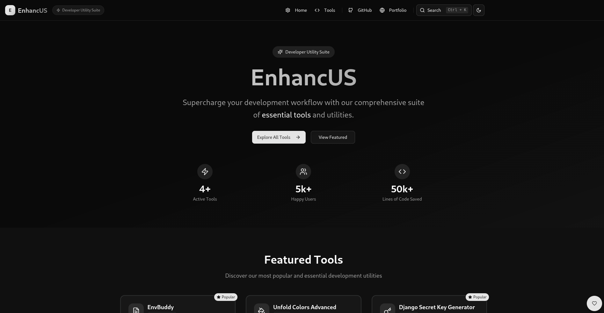
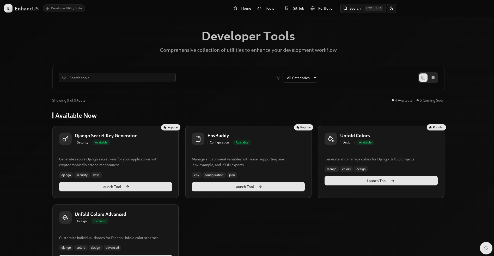
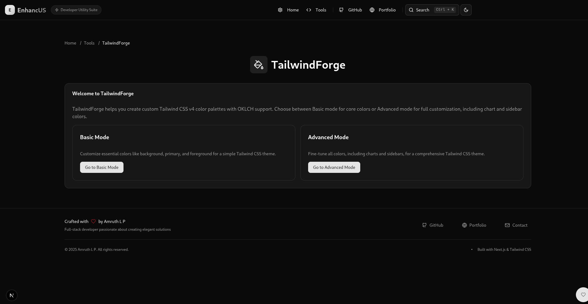
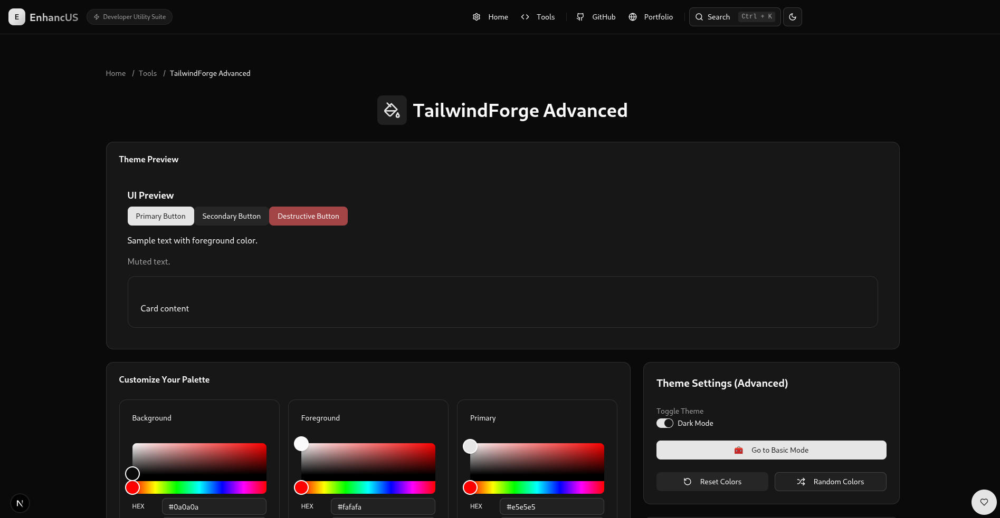
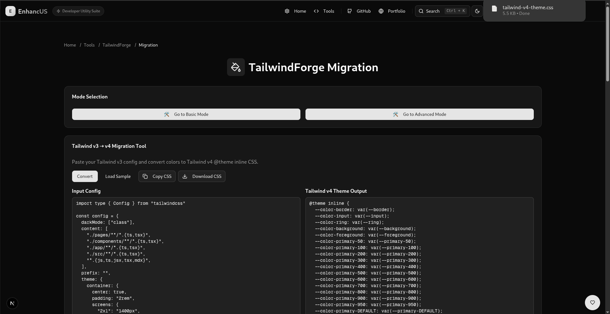
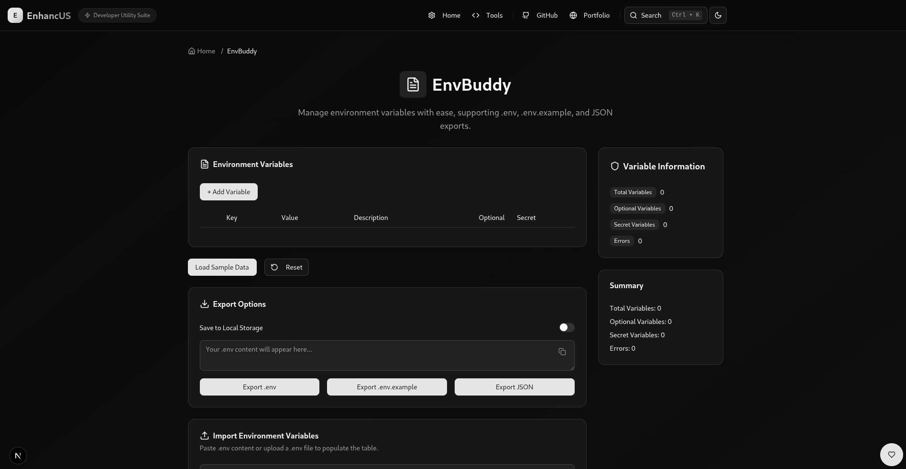
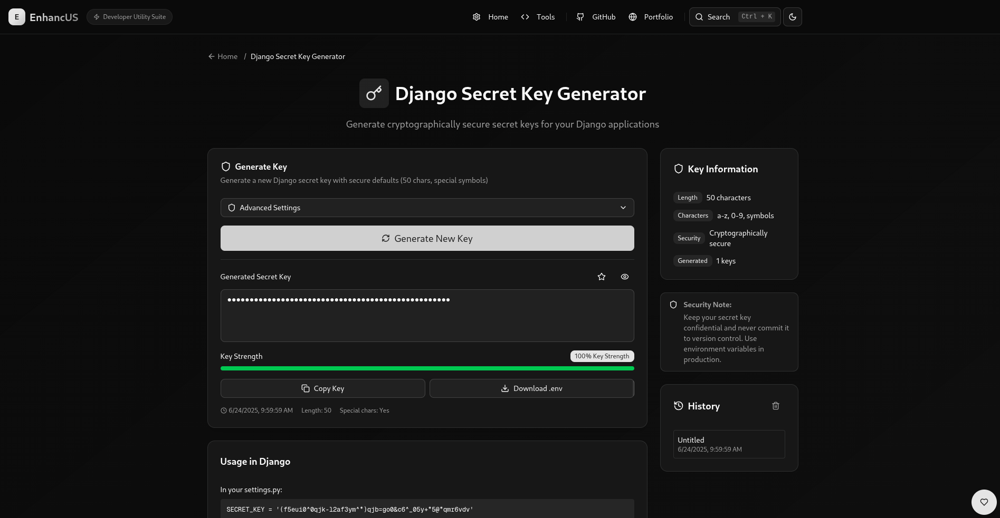
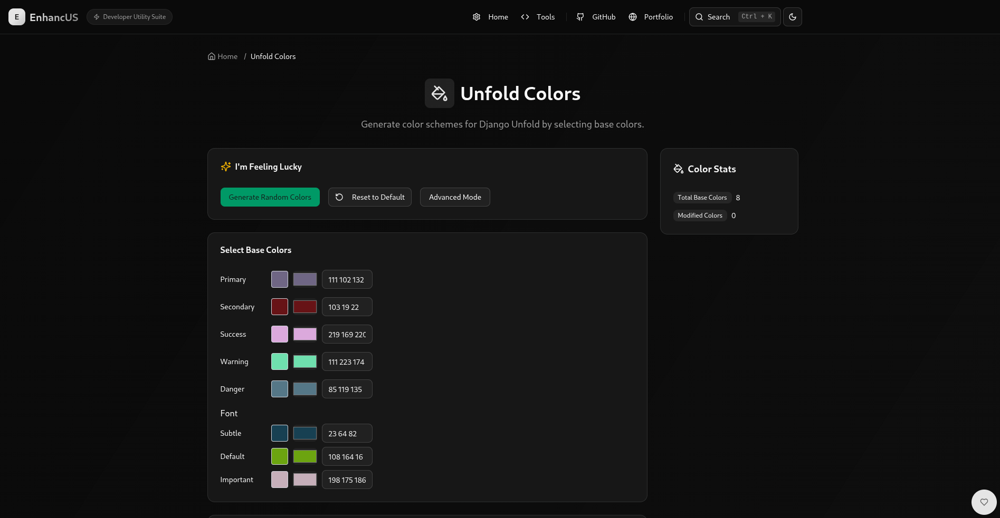
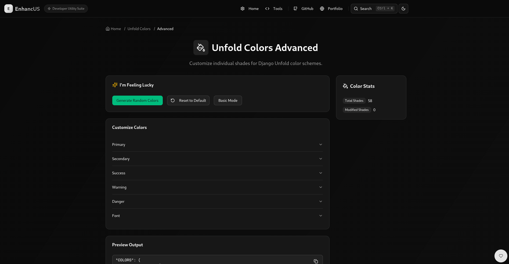

# Enhancus: Developer Utility Suite

Enhancus is a web-based collection of developer tools designed to simplify common tasks. The suite includes **EnvBuddy** for managing environment variables, **Django Secret Key Generator** for creating secure keys, **Unfold Colors** and **Unfold Colors Advanced** for generating Django Unfold color schemes, and **TailwindForge** with Basic and Advanced modes for crafting Tailwind CSS v4 themes with OKLCH support. A **category page** organizes tools by type (e.g., Security, Design). Built with **Next.js**, **TypeScript**, **Tailwind CSS**, and **Shadcn/UI**, Enhancus offers a modern, responsive interface for developers.

## Table of Contents

- [Features](#features)
- [Getting Started](#getting-started)
  - [Prerequisites](#prerequisites)
  - [Installation](#installation)
  - [Running the Application](#running-the-application)
- [Usage](#usage)
  - [TailwindForge](#tailwindforge)
  - [TailwindForge Basic](#tailwindforge-basic)
  - [TailwindForge Advanced](#tailwindforge-advanced)
  - [TailwindForge Migration](#tailwindforge-migration)
  - [EnvBuddy](#envbuddy)
  - [Django Secret Key Generator](#django-secret-key-generator)
  - [Unfold Colors](#unfold-colors)
  - [Unfold Colors Advanced](#unfold-colors-advanced)
  - [Category Page](#category-page)
- [Screenshots](#screenshots)
- [Project Structure](#project-structure)
- [Dependencies](#dependencies)
- [Support the Project](#support-the-project)
- [Contributing](#contributing)
- [License](#license)

## Features

### TailwindForge
- Entry point for TailwindForge at `/tailwind-forge`, providing access to Basic and Advanced modes.
- Responsive landing page with buttons to navigate to Basic and Advanced modes.
- Built with Shadcn/UI, featuring a clean, grid-based layout for mode selection.

### TailwindForge Basic
- Create simple Tailwind CSS v4 color palettes with OKLCH support for core colors (background, foreground, primary, etc.) at `/tailwind-forge/basic`.
- Visual color pickers in a grid (`components/tailwindforge/ColorPickerCard.tsx`).
- Preview light/dark modes with UI elements (`components/tailwindforge/PreviewCard.tsx`).
- Live OKLCH, HEX, HSB conversion.
- Export as `@theme inline` CSS, JSON, or `tailwind.config.ts` with "Copied" confirmation (`components/tailwindforge/ExportCard.tsx`).
- Save/load via LocalStorage.
- Navigation to Advanced mode via "Go to Advanced Mode" button in Theme Settings.
- Reset to default colors or randomize colors via buttons in Theme Settings.
- Responsive UI with `HeaderCard`, `FAQCard` (`data/tailwindForgeFAQ.ts`).

### TailwindForge Advanced
- Forge custom Tailwind CSS v4 color palettes with OKLCH support, including chart and sidebar colors, at `/tailwind-forge/advanced`.
- Visual color pickers in a grid (`components/tailwindforge/ColorPickerCard.tsx`).
- Preview light/dark modes with UI elements (`components/tailwindforge/PreviewCard.tsx`).
- Live OKLCH, HEX, HSB conversion.
- Export as `@theme inline` CSS, JSON, or `tailwind.config.ts` with "Copied" confirmation (`components/tailwindforge/ExportCard.tsx`).
- Save/load via LocalStorage.
- Navigation to Basic mode via "Go to Basic Mode" button in Theme Settings.
- Reset to default colors or randomize colors via buttons in Theme Settings.
- Responsive UI with `HeaderCard`, `FAQCard` (`data/tailwindForgeFAQ.ts`).

### TailwindForge Migration
- Convert Tailwind v3 color configurations to Tailwind v4 `@theme inline` CSS with OKLCH support at `/tailwind-forge/migration`.
- Supports nested color objects (e.g., `primary.DEFAULT`, `primary.50`) using `generateFromNestedColors` (`utils/tailwindUtils.ts`).
- Uses `culori` for HEX-to-OKLCH conversion, preserving non-HEX values (e.g., `hsl(var(--primary))`).
- Side-by-side input/output textareas for pasting v3 config and viewing v4 CSS.
- Features "Convert", "Load Sample", "Copy CSS", and "Download CSS" buttons with "Copied" confirmation.
- Includes migration-specific FAQs (`data/tailwindForgeFAQ.ts`).
- Navigation to Basic and Advanced modes via buttons in Mode Selection.
- Responsive UI with `HeaderCard`, `FAQCard` at the bottom.

### EnvBuddy
- **Manage Environment Variables**: Add, edit, delete, and reorder variables in a table interface with drag-and-drop (`@dnd-kit`), optional/secret toggles, and descriptions.
- **Import**: Paste or upload `.env` files.
- **Export**: Download as `envbuddy.env` (with comments), `envbuddy.env.example`, or `envbuddy.json`.
- **Validation**: Real-time checks for duplicates or missing values.
- **Persistence**: Optional LocalStorage.
- **Utilities**: Load sample data, reset variables.
- **UI**: Responsive with Shadcn/UI, `HeaderCard`, `InfoCard` (stats), `FAQCard` (`data/envBuddyFAQ.ts`).

### Django Secret Key Generator
- Generate cryptographically secure keys (`utils/tailwindUtils.ts`).
- Copy keys, toggle visibility, track history (`HistoryCard.tsx`), strength indicator (`StrengthIndicator.tsx`).
- Usage guides and FAQs (`data/djangoFAQ.ts`).

### Unfold Colors
- Generate color schemes for Django Unfold (`components/unfoldcolors/ColorPicker.tsx`).
- Preview in a mock admin interface, export configurations (`utils/colorUtils.ts`).
- Responsive UI with `HeaderCard`, `FAQCard` (`data/unfoldColorsFAQ.ts`).

### Unfold Colors Advanced
- Customize individual shades with HSL adjustments (`components/unfoldcolors/ColorPicker.tsx`).
- Preview and export advanced configurations.
- Responsive UI with `HeaderCard`, `FAQCard`.

### Category(Tools) Page
- Browse tools by category (Security, Configuration, Design) at `/tools`.
- Display tools from `data/tools.ts` with cards (`components/ui/card.tsx`).
- Links to tool pages (e.g., `/env-buddy`, `/tailwind-forge`).

## Getting Started

### Prerequisites
- **Node.js**: v18 or higher.
- **npm**: v8 or higher.
- A modern web browser.

### Installation
1. Clone the repository:
   ```bash
   git clone https://github.com/amruthlp12/enhancus.git
   cd enhancus
   ```
2. Install dependencies:
   ```bash
   npm install
   ```
3. Install Shadcn/UI components:
   ```bash
   npx shadcn-ui@latest add accordion alert badge button card command dialog dropdown-menu input label popover separator slider switch table textarea tabs
   ```

### Running the Application
1. Start the development server:
   ```bash
   npm run dev
   ```
   Open `http://localhost:3000`.
2. Build for production:
   ```bash
   npm run build
   npm run start
   ```

## Usage

### TailwindForge
1. Navigate to `/tailwind-forge`.
2. Choose between Basic and Advanced modes via buttons.
3. Access core color customization (Basic) or full palette customization (Advanced).

### TailwindForge Basic
1. Navigate to `/tailwind-forge/basic`.
2. Customize core colors via `ColorPickerCard.tsx` (grid layout).
3. Preview light/dark modes in `PreviewCard.tsx`.
4. Export as CSS, JSON, or `tailwind.config.ts` with “Copied” confirmation (`ExportCard.tsx`).
5. Save/load via LocalStorage.
6. Switch to Advanced mode via "Go to Advanced Mode" button.
7. Reset to default colors or generate random colors via Theme Settings buttons.
8. Refer to `FAQCard.tsx` (`data/tailwindForgeFAQ.ts`).

**Example `tailwind.config.ts` Output**:
```typescript
/** @type {import('tailwindcss').Config} */
const config = {
  darkMode: "class",
  theme: {
    colors: {
      "background": "oklch(1 0 0)",
      "foreground": "oklch(0.145 0 0)",
      "primary": "oklch(0.205 0 0)",
      // ...
    },
    extend: {
      colors: {
        "background": "oklch(0.145 0 0)",
        "foreground": "oklch(0.985 0 0)",
        "primary": "oklch(0.922 0 0)",
        // ...
      }
    }
  }
};

export default config;
```

### TailwindForge Advanced
1. Navigate to `/tailwind-forge/advanced`.
2. Customize all colors, including chart/sidebar.
3. Preview, export as CSS, JSON, or `tailwind.config.ts` with “Copied” confirmation, save/load.
4. Switch to Basic mode via "Go to Basic Mode" button.
5. Reset to default colors or generate random colors via Theme Settings buttons.
6. Refer to `FAQCard.tsx`.

### TailwindForge Migration
1. Navigate to `/tailwind-forge/migration`.
2. Paste a Tailwind v3 `tailwind.config.js` (e.g., `theme: { colors: { ... } }`) into the input textarea.
3. Click “Load Sample” for a sample config with nested colors.
4. Click “Convert” to generate Tailwind v4 `@theme inline` CSS with OKLCH colors.
5. Copy the output CSS to the clipboard or download as `tailwind-v4-theme.css`.
6. Switch to Basic or Advanced modes via "Go to Basic Mode" or "Go to Advanced Mode" buttons.
7. View migration-specific FAQs at the bottom for help.

**Example Input Config**:
```javascript
theme: {
  colors: {
    background: "#ffffff",
    foreground: "#111827",
    primary: {
      DEFAULT: "#3b82f6",
      foreground: "#ffffff",
      50: "#eff6ff",
      100: "#dbeafe",
      200: "#bfdbfe"
    }
  }
}
```

**Example Output CSS**:
```css
@theme inline {
  --color-background: var(--background);
  --color-foreground: var(--foreground);
  --color-primary: var(--primary);
  --color-primary-foreground: var(--primary-foreground);
  --color-primary-50: var(--primary-50);
  --color-primary-100: var(--primary-100);
  --color-primary-200: var(--primary-200);
}

:root {
  --background: oklch(1.000 0 0);
  --foreground: oklch(0.145 0 0);
  --primary: oklch(0.656 0.151 264.71);
  --primary-foreground: oklch(1.000 0 0);
  --primary-50: oklch(0.977 0.013 264.71);
  --primary-100: oklch(0.941 0.027 264.71);
  --primary-200: oklch(0.887 0.054 264.71);
}

.dark {
  --background: oklch(1.000 0 0);
  --foreground: oklch(0.145 0 0);
  --primary: oklch(0.656 0.151 264.71);
  --primary-foreground: oklch(1.000 0 0);
  --primary-50: oklch(0.977 0.013 264.71);
  --primary-100: oklch(0.941 0.027 264.71);
  --primary-200: oklch(0.887 0.054 264.71);
}
```

### EnvBuddy
1. Navigate to `/env-buddy`.
2. Add variables in `EnvVariableTable.tsx` (e.g., `API_KEY=abc123xyz789`).
3. Reorder via drag-and-drop, toggle optional/secret, add descriptions.
4. Import `.env` content or files via `EnvImportCard.tsx`.
5. Export as `.env`, `.env.example`, or `.json`.
6. Use “Load Sample Data” or “Reset” buttons.
7. Monitor stats in `InfoCard.tsx`.

**Example `envbuddy.env`**:
```env
# Description: Your API key
API_KEY=abc123xyz789
# Description: Enable debug logs
DEBUG_MODE=true
```

### Django Secret Key Generator
1. Navigate to `/key-gen`.
2. Generate keys, copy, toggle visibility, view history (`HistoryCard.tsx`).
3. Check strength (`StrengthIndicator.tsx`).
4. Follow guides in `FAQCard.tsx`.

### Unfold Colors
1. Navigate to `/unfold-colors`.
2. Customize colors via `ColorPicker.tsx`.
3. Preview in mock admin UI, export via `colorUtils.ts`.
4. Refer to `FAQCard.tsx` (`data/unfoldColorsFAQ.ts`).

### Unfold Colors Advanced
1. Navigate to `/unfold-colors/advanced`.
2. Fine-tune shades, preview, export.
3. Use `FAQCard.tsx` for guides.

### Category Page
1. Navigate to `/tools`.
2. Browse tools by category, click to visit (e.g., `/tailwind-forge`, `/tailwind-forge/basic`).

## Screenshots
- **Main Page**: 
- **Category Page**: 
- **TailwindForge**: 
- **TailwindForge Basic**: 
- **TailwindForge Advanced**: 
- **TailwindForge Migration**: 
- **EnvBuddy**: 
- **Django Secret Key Generator**: 
- **Unfold Colors**: 
- **Unfold Colors Advanced**: 

## Project Structure
```
├── app/
│   ├── env-buddy/
│   │   ├── EnvBuddyPage.tsx
│   │   └── page.tsx
│   ├── key-gen/
│   │   └── page.tsx
│   ├── tools/
│   │   └── page.tsx
│   ├── unfold-colors/
│   │   ├── advanced/
│   │   │   └── page.tsx
│   │   └── page.tsx
│   ├── tailwind-forge/
│   │   ├── basic/
│   │   │   ├── TailwindForgeBasicPage.tsx
│   │   │   └── page.tsx
│   │   ├── advanced/
│   │   │   ├── TailwindForgeAdvancedPage.tsx
│   │   │   └── page.tsx
│   │   ├── migration/
│   │   │   └── page.tsx
│   │   └── page.tsx
│   ├── layout.tsx
│   ├── page.tsx
│   ├── favicon.ico
│   ├── globals.css
├── components/
│   ├── django_key_gen/
│   │   ├── HistoryCard.tsx
│   │   ├── StrengthIndicator.tsx
│   ├── envbuddy/
│   │   ├── EnvImportCard.tsx
│   │   ├── EnvVariableTable.tsx
│   ├── unfoldcolors/
│   │   ├── ColorPicker.tsx
│   ├── tailwindforge/
│   │   ├── ColorPickerCard.tsx
│   │   ├── PreviewCard.tsx
│   │   ├── ExportCard.tsx
│   │   ├── store.ts
│   │   ├── ThemeToggle.tsx
│   ├── ui/
│   │   ├── accordion.tsx
│   │   ├── alert.tsx
│   │   ├── badge.tsx
│   │   ├── button.tsx
│   │   ├── card.tsx
│   │   ├── command.tsx
│   │   ├── dialog.tsx
│   │   ├── dropdown-menu.tsx
│   │   ├── input.tsx
│   │   ├── label.tsx
│   │   ├── popover.tsx
│   │   ├── separator.tsx
│   │   ├── slider.tsx
│   │   ├── switch.tsx
│   │   ├── table.tsx
│   │   ├── textarea.tsx
│   │   ├── tabs.tsx
│   ├── AlertCard.tsx
│   ├── CodeGuideCard.tsx
│   ├── DisplayField.tsx
│   ├── FAQCard.tsx
│   ├── Footer.tsx
│   ├── HeaderCard.tsx
│   ├── InfoCard.tsx
│   ├── Navbar.tsx
│   ├── Support.tsx
│   ├── mode-toggle.tsx
│   ├── search-command.tsx
│   ├── theme-provider.tsx
├── data/
│   ├── djangoFAQ.ts
│   ├── envBuddyFAQ.ts
│   ├── tools.ts
│   ├── unfoldColorsFAQ.ts
│   ├── tailwindForgeFAQ.ts
├── types/
│   ├── django_key_gen.ts
│   ├── envbuddy.ts
│   ├── types.ts
│   ├── unfoldColors.ts
│   ├── tailwindforge.ts
├── utils/
│   ├── colorUtils.ts
│   ├── envUtils.ts
│   ├── keyUtils.ts
│   ├── tailwindUtils.ts
├── screenshots/
│   ├── main-page.png
│   ├── category-page.png
│   ├── tailwindforge.png
│   ├── tailwindforge-basic.png
│   ├── tailwindforge-advanced.png
│   ├── envbuddy.png
│   ├── django-keygen.png
│   ├── unfold-colors.png
│   ├── unfold-colors-advanced.png
├── lib/
│   ├── utils.ts
├── components.json
├── eslint.config.mjs
├── next.config.ts
├── next-sitemap.config.js
├── postcss.config.mjs
├── tsconfig.json
├── package.json
├── README.md
```

## Dependencies
- **Core**: `next@^14.2.3`, `react@^18`, `typescript@^5`, `tailwindcss@^4`.
- **UI**: `lucide-react`, `@radix-ui/react-*` (Shadcn/UI).
- **EnvBuddy**: `@dnd-kit/core`, `@dnd-kit/sortable`, `uuid`.
- **TailwindForge**: `react-colorful`, `culori@^4`, `zustand`.
- **Dev**: `@types/react`, `@types/node`, `@types/uuid`, `@types/culori`.

Install:
```bash
npm install next react typescript tailwindcss@4 lucide-react @radix-ui/react-* @dnd-kit/core @dnd-kit/sortable uuid react-colorful culori@4 json5 zustand
npm install -D @types/react @types/node @types/uuid @types/culori
```

## Support the Project
Support via [Ko-Fi](https://ko-fi.com/codewithamruth) or [PayPal](https://paypal.me/amruthlp12).
 Star the repo: [GitHub](https://github.com/amruthlp12/enhancus).

## Contributing
1. Fork the repository.
2. Create a branch: `git checkout -b feature/your-feature`.
3. Commit changes: `git commit -m "Add your-feature"`.
4. Push: `git push origin feature/your-feature`.
5. Open a Pull Request.

**Guidelines**: Use TypeScript, Shadcn/UI, Tailwind CSS, Next.js app router. Update documentation.

## License
MIT License. See [LICENSE](LICENSE).