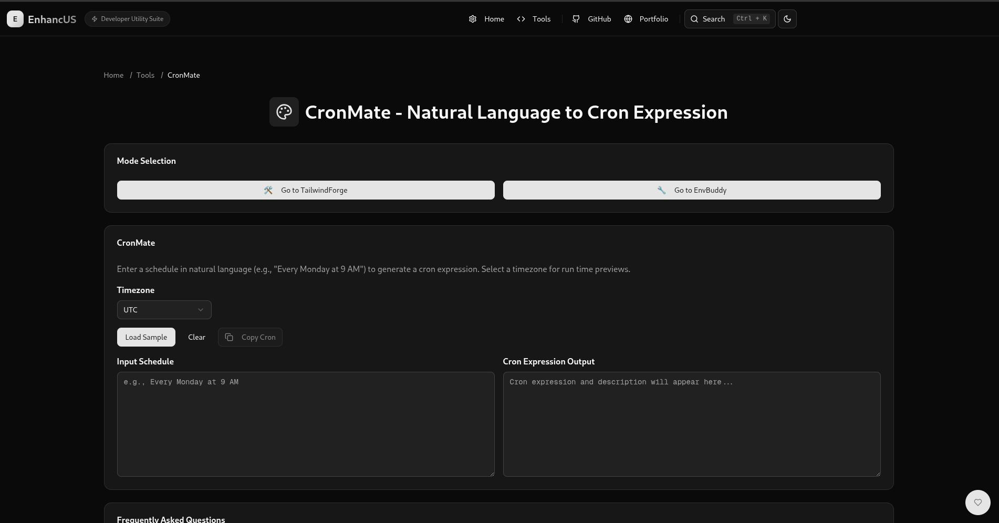

# CronMate

**CronMate** is a browser-based tool within the **Enhancus** suite that converts natural language schedules (e.g., "Every Monday at 9 AM") into standard 5-field cron expressions (minute, hour, day of month, month, day of week). It validates expressions, provides human-readable descriptions, previews the next 5 run times in a selected timezone, and saves recent expressions in LocalStorage. Built with **Next.js 14**, **TypeScript**, **Tailwind CSS v4**, and **Shadcn/UI**, **CronMate** offers a responsive, user-friendly interface for scheduling tasks.

## Features
- **Natural Language Input**: Convert phrases like "Every 5 minutes" or "Every Monday at 9 AM" into cron expressions.
- **Timezone Support**: Preview run times in UTC, America/New_York, Asia/Kolkata, or Europe/London.
- **Validation**: Ensures cron expressions are valid using `cron-parser`.
- **Descriptions**: Generates human-readable descriptions via `cronstrue`.
- **Run Time Preview**: Displays the next 5 execution times in the selected timezone.
- **History**: Saves up to 5 recent expressions in LocalStorage.
- **Copy Functionality**: Copy cron expressions to the clipboard with a single click.
- **Responsive UI**: Built with Shadcn/UI components, including `HeaderCard`, `FAQCard`, and a timezone selector.

## Supported Schedules
**CronMate** supports the following natural language schedules:

### 🕐 Minute-Based Schedules
| Natural Language       | Cron Expression | Description             |
|------------------------|-----------------|-------------------------|
| Every minute           | * * * * *       | Runs every minute       |
| Every 5 minutes        | */5 * * * *     | Every 5 minutes         |
| Every 30 minutes       | */30 * * * *    | Every 30 minutes        |

### 🕒 Hour-Based Schedules
| Natural Language       | Cron Expression | Description             |
|------------------------|-----------------|-------------------------|
| Every hour             | 0 * * * *       | At minute 0 of every hour |
| Every 3 hours          | 0 */3 * * *     | At minute 0, every 3rd hour |
| Every hour at 15 past  | 15 * * * *      | Every hour at 15 minutes past |

### 📅 Daily Schedules
| Natural Language       | Cron Expression | Description             |
|------------------------|-----------------|-------------------------|
| Every day at 9 AM      | 0 9 * * *       | Daily at 9:00 AM        |
| Every day at 6:30 PM   | 30 18 * * *     | Daily at 6:30 PM        |

### 📆 Weekly Schedules
| Natural Language       | Cron Expression | Description             |
|------------------------|-----------------|-------------------------|
| Every Monday at 8 AM   | 0 8 * * 1       | Every Monday at 8:00 AM |
| Every Friday at 6 PM   | 0 18 * * 5      | Every Friday at 6:00 PM |
| Every Sunday at 12 PM  | 0 12 * * 0      | Every Sunday at noon    |

## Getting Started

### Prerequisites
- **Node.js**: v18 or higher.
- **npm**: v8 or higher.
- **Git**: For cloning the repository.
- Access to the **Enhancus** project repository.

### Installation
1. Clone the **Enhancus** repository:
   ```bash
   git clone https://github.com/amruthlp12/enhancus.git
   cd enhancus
   ```
2. Install dependencies:
   ```bash
   npm install
   ```
3. Install Shadcn/UI components:
   ```bash
   npx shadcn-ui@latest add accordion alert badge button card command dialog dropdown-menu input label popover separator slider switch table textarea tabs select
   ```

### Running CronMate
1. Start the development server:
   ```bash
   npm run dev
   ```
2. Open `http://localhost:3000/cronmate` in your browser.

## Usage
1. Navigate to `/cronmate`.
2. Select a timezone (e.g., UTC, America/New_York) from the dropdown.
3. Enter a natural language schedule (e.g., "Every Monday at 9 AM") in the input textarea.
4. View the generated cron expression, description, and next 5 run times.
5. Use the **Copy Cron** button to copy the cron expression to your clipboard.
6. Click **Load Sample** to try "Every Monday at 9 AM" or **Clear** to reset the input.
7. Check the **Recent Expressions** table for previously generated schedules.
8. Refer to the **FAQs** for supported formats and troubleshooting.

### Example
- **Input**: "Every Monday at 9 AM"
- **Output**:
  ```
  0 9 * * 1
  # Description: At 9:00 AM, only on Monday
  ```
- **Next 5 Run Times (UTC)**:
  - Mon, Jul 14, 2025, 9:00 AM
  - Mon, Jul 21, 2025, 9:00 AM
  - Mon, Jul 28, 2025, 9:00 AM
  - Mon, Aug 4, 2025, 9:00 AM
  - Mon, Aug 11, 2025, 9:00 AM
- **Next 5 Run Times (Asia/Kolkata)**:
  - Mon, Jul 14, 2025, 2:30 PM
  - Mon, Jul 21, 2025, 2:30 PM
  - Mon, Jul 28, 2025, 2:30 PM
  - Mon, Aug 4, 2025, 2:30 PM
  - Mon, Aug 11, 2025, 2:30 PM

## Screenshots
- **CronMate**: 

## Development

### Project Structure
Relevant files for **CronMate**:
- `apps/cronmate/page.tsx`: Main page component.
- `utils/cronUtils.ts`: Utility functions for parsing, validating, and describing cron expressions.
- `data/cronmateFAQ.ts`: FAQ data with supported schedules.
- `components/`: Shared UI components (e.g., `HeaderCard.tsx`, `FAQCard.tsx`).
- `public/`: Static assets.

### Dependencies
- `next@14.2.3`: Framework for server-side rendering and static generation.
- `typescript@5`: Type safety.
- `tailwindcss@4`: Utility-first CSS framework.
- `shadcn-ui`: Accessible UI components.
- `cron-parser@5.3.0`: Cron expression parsing and validation.
- `cronstrue@3.0.0`: Human-readable cron descriptions.
- `cron-time-generator@2.0.3`: Generates cron expressions from structured inputs.
- `uuid`: Generates unique IDs for history items.

Install:
```bash
npm install next@14.2.3 react typescript tailwindcss@4 lucide-react @radix-ui/react-* cron-parser@5.3.0 cronstrue@3.0.0 cron-time-generator@2.0.3 uuid
npm install -D @types/react @types/node @types/uuid
```

### Running Locally
1. Install dependencies:
   ```bash
   npm install
   ```
2. Run the development server:
   ```bash
   npm run dev
   ```
3. Run linting:
   ```bash
   npm run lint
   ```
4. Build for production:
   ```bash
   npm run build
   ```

### Testing
1. Test **CronMate** at `http://localhost:3000/cronmate`:
   - Verify all supported schedules (see tables above).
   - Test timezone changes (e.g., UTC, Asia/Kolkata).
   - Test invalid inputs (e.g., "Every second Monday") for error messages:
     - Expected: "Failed to parse input: Unsupported phrase..."
   - Confirm **Copy Cron**, **Clear**, and **Load Sample** functionality.
   - Verify LocalStorage saves up to 5 recent expressions.
   - Check FAQs for schedule tables.
2. Run linting to ensure TypeScript compliance:
   ```bash
   npm run lint
   ```

## Contributing
1. Fork the **Enhancus** repository.
2. Create a feature branch:
   ```bash
   git checkout -b feature/cronmate-your-feature
   ```
3. Commit changes:
   ```bash
   git commit -m "Add CronMate feature"
   ```
4. Push to your fork:
   ```bash
   git push origin feature/cronmate-your-feature
   ```
5. Open a pull request to the `main` branch.

**Guidelines**: Use TypeScript, Shadcn/UI, Tailwind CSS, and Next.js app router. Update `apps/cronmate/README.md` for **CronMate**-specific changes.

## License
MIT License. See [LICENSE](../../LICENSE).

## Contact
For issues or feature requests, open an issue on the [GitHub repository](https://github.com/amruthlp12/enhancus/issues).