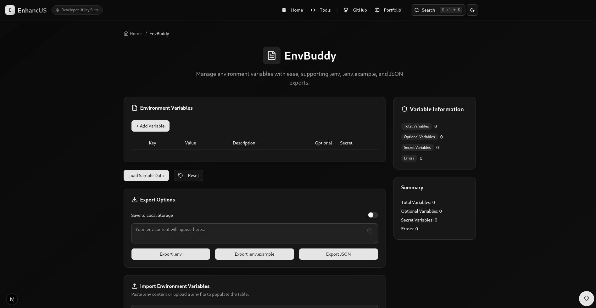

# EnvBuddy

**EnvBuddy** is a tool within the **Enhancus** suite for visually managing environment variables. It provides a table-based interface for adding, editing, deleting, and reordering variables, with support for import/export and drag-and-drop functionality. Built with **Next.js 14**, **TypeScript**, **Tailwind CSS v4**, and **Shadcn/UI**, it offers a responsive, developer-friendly experience.

## Features
- **Manage Variables**: Add, edit, delete, and reorder environment variables in a table (`components/envbuddy/EnvVariableTable.tsx`).
- **Drag-and-Drop**: Reorder variables using `@dnd-kit/sortable`.
- **Toggles**: Mark variables as optional or secret with visibility toggles.
- **Import**: Paste or upload `.env` files via `components/envbuddy/EnvImportCard.tsx`.
- **Export**: Download as `envbuddy.env` (with comments), `envbuddy.env.example`, or `envbuddy.json`.
- **Validation**: Real-time checks for duplicate keys or missing values.
- **Persistence**: Optional LocalStorage for saving variables.
- **Utilities**: Load sample data or reset variables.
- **Responsive UI**: Built with Shadcn/UI, including `HeaderCard`, `InfoCard` (stats), and `FAQCard` (`data/envBuddyFAQ.ts`).

## Getting Started

### Prerequisites
- **Node.js**: v18 or higher.
- **npm**: v8 or higher.
- **Git**: For cloning the repository.
- Access to the **Enhancus** project repository.

### Installation
1. Clone the **Enhancus** repository:
   ```bash
   git clone https://github.com/amruthlp12/enhancus.git
   cd enhancus
   ```
2. Install dependencies:
   ```bash
   npm install
   ```
3. Install Shadcn/UI components:
   ```bash
   npx shadcn-ui@latest add accordion alert badge button card command dialog dropdown-menu input label popover separator slider switch table textarea tabs
   ```

### Running EnvBuddy
1. Start the development server:
   ```bash
   npm run dev
   ```
2. Open `http://localhost:3000/env-buddy` in your browser.

## Usage
1. Navigate to `/env-buddy`.
2. Add variables in the table (e.g., `API_KEY=abc123xyz789`).
3. Reorder via drag-and-drop, toggle optional/secret, or add descriptions.
4. Import `.env` content or files via the import card.
5. Export as `.env`, `.env.example`, or `.json`.
6. Use "Load Sample Data" or "Reset" buttons.
7. Monitor stats (e.g., variable count) in the info card.
8. Refer to FAQs (`data/envBuddyFAQ.ts`) for guidance.

### Example
- **Input Variables**:
  - `API_KEY=abc123xyz789` (Description: "Your API key")
  - `DEBUG_MODE=true` (Description: "Enable debug logs")
- **Exported `envbuddy.env`**:
  ```env
  # Description: Your API key
  API_KEY=abc123xyz789
  # Description: Enable debug logs
  DEBUG_MODE=true
  ```

## Screenshots
- **EnvBuddy**: 

## Development

### Project Structure
Relevant files for **EnvBuddy**:
- `apps/env-buddy/page.tsx`: Main page component.
- `components/envbuddy/`: Components (`EnvVariableTable.tsx`, `EnvImportCard.tsx`).
- `utils/envUtils.ts`: Environment variable parsing and validation.
- `data/envBuddyFAQ.ts`: FAQ data.
- `public/`: Static assets.

### Dependencies
- `next@14.2.3`: Framework for server-side rendering and static generation.
- `typescript@5`: Type safety.
- `tailwindcss@4`: Utility-first CSS framework.
- `shadcn-ui`: Accessible UI components.
- `@dnd-kit/core`: Drag-and-drop functionality.
- `@dnd-kit/sortable`: Sortable table support.
- `uuid`: Generates unique IDs for variables.

Install:
```bash
npm install next@14.2.3 react typescript tailwindcss@4 lucide-react @radix-ui/react-* @dnd-kit/core @dnd-kit/sortable uuid
npm install -D @types/react @types/node @types/uuid
```

### Running Locally
1. Install dependencies:
   ```bash
   npm install
   ```
2. Run the development server:
   ```bash
   npm run dev
   ```
3. Run linting:
   ```bash
   npm run lint
   ```
4. Build for production:
   ```bash
   npm run build
   ```

### Testing
1. Test **EnvBuddy** at `http://localhost:3000/env-buddy`:
   - Add, edit, delete, and reorder variables.
   - Test import/export functionality with `.env` and `.json` formats.
   - Verify validation for duplicates or missing values.
   - Confirm save/load and reset functionality.
   - Check FAQs for guidance.
2. Run linting to ensure TypeScript compliance:
   ```bash
   npm run lint
   ```

## Contributing
1. Fork the **Enhancus** repository.
2. Create a feature branch:
   ```bash
   git checkout -b feature/envbuddy-your-feature
   ```
3. Commit changes:
   ```bash
   git commit -m "Add EnvBuddy feature"
   ```
4. Push to your fork:
   ```bash
   git push origin feature/envbuddy-your-feature
   ```
5. Open a pull request to the `main` branch.

**Guidelines**: Use TypeScript, Shadcn/UI, Tailwind CSS, and Next.js app router. Update `apps/envbuddy/README.md` for **EnvBuddy**-specific changes.

## License
MIT License. See [LICENSE](../../LICENSE).

## Contact
For issues or feature requests, open an issue on the [GitHub repository](https://github.com/amruthlp12/enhancus/issues).