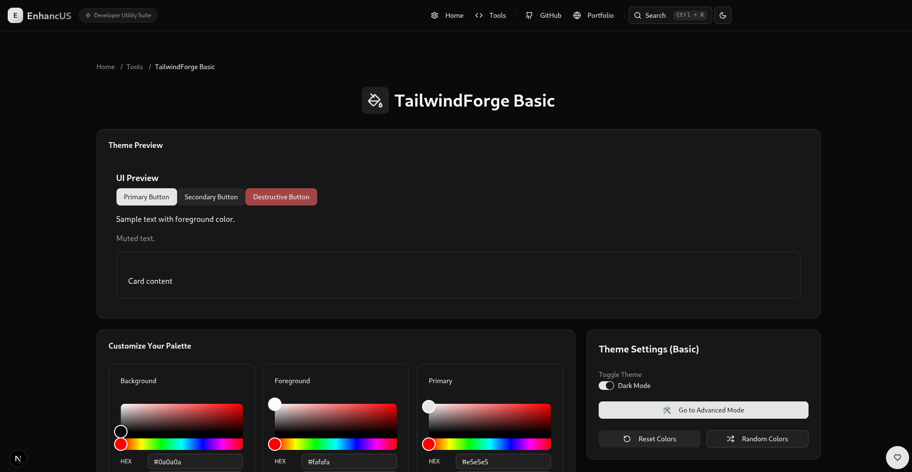

# TailwindForge

**TailwindForge** is a tool within the **Enhancus** suite for creating and migrating Tailwind CSS v4 color palettes using OKLCH color space. It offers **Basic**, **Advanced**, and **Migration** modes to build, customize, and convert color configurations. Built with **Next.js 14**, **TypeScript**, **Tailwind CSS v4**, and **Shadcn/UI**, it provides a responsive interface with visual color pickers, live previews, and export options.

## Features
- **Basic Mode**: Customize core colors (e.g., background, foreground, primary) at `/tailwind-forge/basic`.
- **Advanced Mode**: Customize full palettes, including chart and sidebar colors, at `/tailwind-forge/advanced`.
- **Migration Mode**: Convert Tailwind v3 configurations to v4 OKLCH-based `@theme inline` CSS at `/tailwind-forge/migration`.
- **Visual Color Pickers**: Use `react-colorful` for intuitive color selection (`components/tailwindforge/ColorPickerCard.tsx`).
- **Live Previews**: View light/dark mode UI elements (`components/tailwindforge/PreviewCard.tsx`).
- **Color Conversion**: Supports OKLCH, HEX, and HSB formats.
- **Export Options**: Export as `@theme inline` CSS, JSON, or `tailwind.config.ts` with "Copied" confirmation (`components/tailwindforge/ExportCard.tsx`).
- **Persistence**: Save/load palettes via LocalStorage.
- **Utilities**: Reset to default colors or randomize colors via Theme Settings.
- **Responsive UI**: Built with Shadcn/UI, including `HeaderCard` and `FAQCard` (`data/tailwindForgeFAQ.ts`).

## Getting Started

### Prerequisites
- **Node.js**: v18 or higher.
- **npm**: v8 or higher.
- **Git**: For cloning the repository.
- Access to the **Enhancus** project repository.

### Installation
1. Clone the **Enhancus** repository:
   ```bash
   git clone https://github.com/amruthlp12/enhancus.git
   cd enhancus
   ```
2. Install dependencies:
   ```bash
   npm install
   ```
3. Install Shadcn/UI components:
   ```bash
   npx shadcn-ui@latest add accordion alert badge button card command dialog dropdown-menu input label popover separator slider switch table textarea tabs
   ```

### Running TailwindForge
1. Start the development server:
   ```bash
   npm run dev
   ```
2. Open `http://localhost:3000/tailwind-forge` in your browser.

## Usage
1. Navigate to `/tailwind-forge` to choose between Basic, Advanced, or Migration modes.
2. **Basic Mode** (`/tailwind-forge/basic`):
   - Customize core colors using visual pickers.
   - Preview light/dark modes.
   - Export as CSS, JSON, or `tailwind.config.ts`.
   - Save/load via LocalStorage or reset/randomize colors.
3. **Advanced Mode** (`/tailwind-forge/advanced`):
   - Customize full palettes, including chart/sidebar colors.
   - Preview, export, save/load, or reset/randomize.
4. **Migration Mode** (`/tailwind-forge/migration`):
   - Paste a Tailwind v3 `tailwind.config.js` into the input textarea.
   - Click "Load Sample" for a sample config.
   - Click "Convert" to generate v4 `@theme inline` CSS.
   - Copy or download the output CSS.
5. Refer to FAQs (`data/tailwindForgeFAQ.ts`) for guidance.

### Example (Migration Mode)
- **Input Config**:
  ```javascript
  theme: {
    colors: {
      background: "#ffffff",
      foreground: "#111827",
      primary: {
        DEFAULT: "#3b82f6",
        foreground: "#ffffff",
        50: "#eff6ff"
      }
    }
  }
  ```
- **Output CSS**:
  ```css
  @theme inline {
    --color-background: var(--background);
    --color-foreground: var(--foreground);
    --color-primary: var(--primary);
    --color-primary-foreground: var(--primary-foreground);
    --color-primary-50: var(--primary-50);
  }

  :root {
    --background: oklch(1.000 0 0);
    --foreground: oklch(0.145 0 0);
    --primary: oklch(0.656 0.151 264.71);
    --primary-foreground: oklch(1.000 0 0);
    --primary-50: oklch(0.977 0.013 264.71);
  }

  .dark {
    --background: oklch(1.000 0 0);
    --foreground: oklch(0.145 0 0);
    --primary: oklch(0.656 0.151 264.71);
    --primary-foreground: oklch(1.000 0 0);
    --primary-50: oklch(0.977 0.013 264.71);
  }
  ```

## Screenshots
- **TailwindForge**: 
- **TailwindForge Basic**: 
- **TailwindForge Advanced**: 
- **TailwindForge Migration**: 

## Development

### Project Structure
Relevant files for **TailwindForge**:
- `apps/tailwind-forge/page.tsx`: Landing page for mode selection.
- `apps/tailwind-forge/basic/page.tsx`: Basic mode page.
- `apps/tailwind-forge/advanced/page.tsx`: Advanced mode page.
- `apps/tailwind-forge/migration/page.tsx`: Migration mode page.
- `components/tailwindforge/`: Components (`ColorPickerCard.tsx`, `PreviewCard.tsx`, `ExportCard.tsx`, `store.ts`, `ThemeToggle.tsx`).
- `utils/tailwindUtils.ts`: Color conversion and migration utilities.
- `data/tailwindForgeFAQ.ts`: FAQ data.
- `public/`: Static assets.

### Dependencies
- `next@14.2.3`: Framework for server-side rendering and static generation.
- `typescript@5`: Type safety.
- `tailwindcss@4`: Utility-first CSS framework.
- `shadcn-ui`: Accessible UI components.
- `react-colorful`: Color picker component.
- `culori@4`: Color conversion utilities.
- `zustand`: State management.
- `uuid`: Generates unique IDs.

Install:
```bash
npm install next@14.2.3 react typescript tailwindcss@4 lucide-react @radix-ui/react-* react-colorful culori@4 zustand uuid
npm install -D @types/react @types/node @types/uuid @types/culori
```

### Running Locally
1. Install dependencies:
   ```bash
   npm install
   ```
2. Run the development server:
   ```bash
   npm run dev
   ```
3. Run linting:
   ```bash
   npm run lint
   ```
4. Build for production:
   ```bash
   npm run build
   ```

### Testing
1. Test **TailwindForge** at `http://localhost:3000/tailwind-forge`:
   - Verify navigation to Basic, Advanced, and Migration modes.
   - Test color customization, previews, and exports in Basic/Advanced modes.
   - Test v3-to-v4 conversion in Migration mode with sample configs.
   - Confirm save/load, reset, and randomize functionality.
   - Check FAQs for guidance.
2. Run linting to ensure TypeScript compliance:
   ```bash
   npm run lint
   ```

## Contributing
1. Fork the **Enhancus** repository.
2. Create a feature branch:
   ```bash
   git checkout -b feature/tailwindforge-your-feature
   ```
3. Commit changes:
   ```bash
   git commit -m "Add TailwindForge feature"
   ```
4. Push to your fork:
   ```bash
   git push origin feature/tailwindforge-your-feature
   ```
5. Open a pull request to the `main` branch.

**Guidelines**: Use TypeScript, Shadcn/UI, Tailwind CSS, and Next.js app router. Update `apps/tailwindforge/README.md` for **TailwindForge**-specific changes.

## License
MIT License. See [LICENSE](../../LICENSE).

## Contact
For issues or feature requests, open an issue on the [GitHub repository](https://github.com/amruthlp12/enhancus/issues).